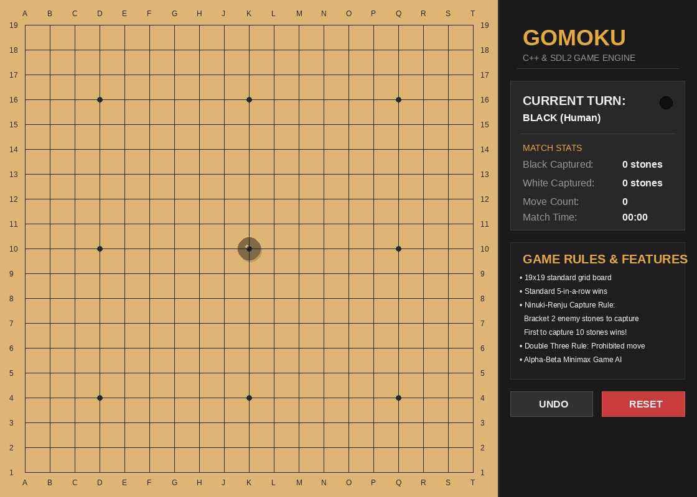
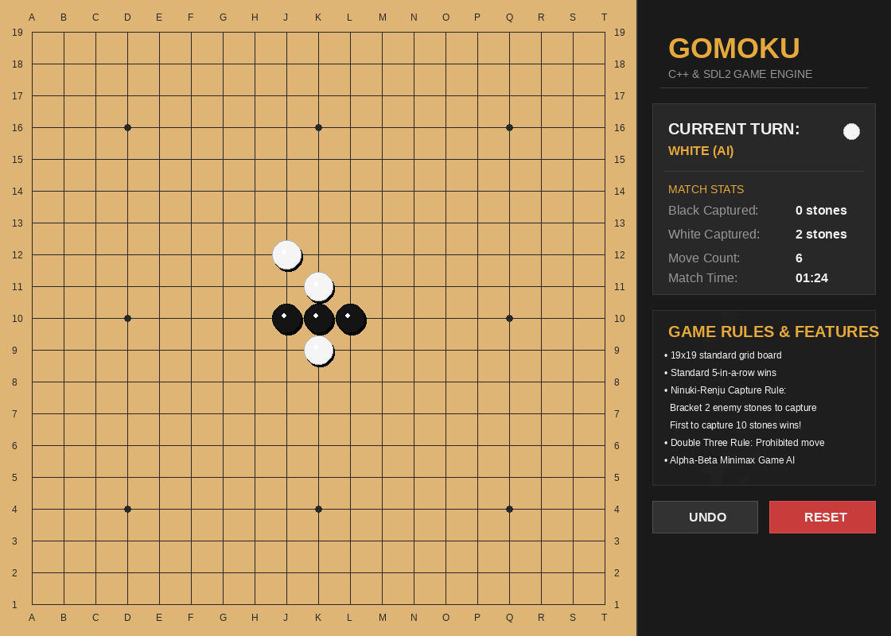
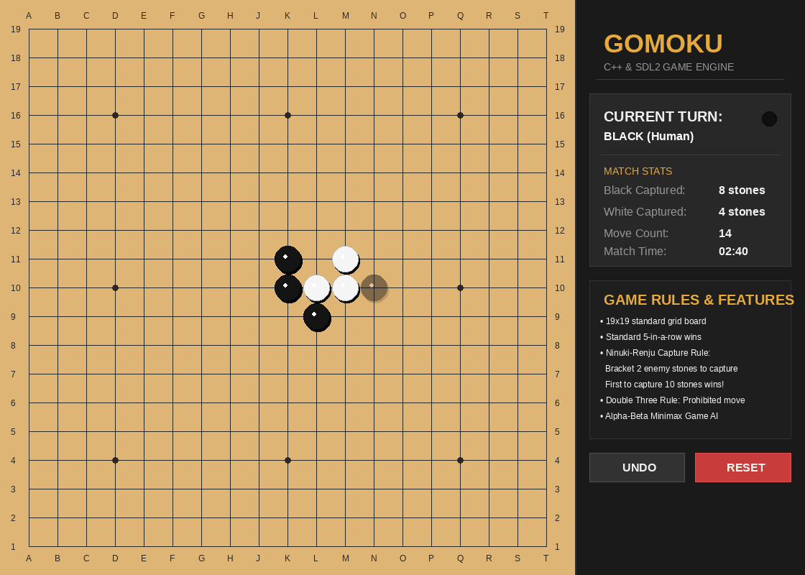

# 🎯 Gomoku Game Engine in C++17 & SDL2

An advanced, highly optimized **Gomoku (Five-in-a-Row) game engine** built from scratch in C++17. It features a rich 2D graphical user interface using **SDL2**, a built-in bitmap font renderer, and a sophisticated artificial intelligence opponent powered by **Alpha-Beta Minimax (Negamax) search** with **Candidate Move Ordering**.

In addition to standard Gomoku, this engine implements the unique and tactical **Ninuki-Renju Capture Rules** and the **Double-Three Restriction**, creating a deep and balanced competitive experience.

---

## 📸 Project Showcase & Visuals

Here is a visual overview of the game engine in action, showing the GUI layout, AI search, and game mechanics:

### 🎮 1. Smooth Gameplay & Elegant GUI
The interface features a warm wooden 19x19 Go board, translucent **hover-ghost stones** to guide player clicks, coordinate grid markings, and a sleek dark sidebar displaying real-time stats (turn indicator, move counter, and game elapsed timer).

<p align="center">
  
</p>

### 🧠 2. AI Engine "Brain" & Alpha-Beta Search
Watch the AI analyze the board! White (AI) evaluates candidate moves, calculates minimax scores, and utilizes **Alpha-Beta pruning** with **Candidate Move Ordering** to block Black's open-three threat instantly. 

<p align="center">
  
</p>

### ⚔️ 3. Ninuki-Renju Capture Mechanic & Victory
A demonstration of the capture mechanic: Black places a stone at `S13`, bracketing a pair of adjacent White stones at `S11` and `S12`. The captured White stones flash and are swept off the board, bringing Black's capture score to 10 and triggering the victory banner!

<p align="center">
  
</p>

---

## ⚡ Key Features & Mechanics

### 1. Game Rule Variants
*   **19x19 Standard Grid**: Played on a full-size Go board with traditional star points (Hoshi) for reference.
*   **Ninuki-Renju Capture Rule**: If you bracket exactly two of your opponent's adjacent stones (e.g., `Black - White - White - Black` along any line), those two stones are **captured and removed** from the board. 
*   **Dual Win Conditions**: You can win by either:
    1.  Aligning **5 or more stones in a row** (horizontal, vertical, or diagonal).
    2.  Capturing **10 of your opponent's stones** (5 pairs).
*   **Double Three (San-San) Restriction**: To prevent an overwhelming advantage, players are prohibited from placing a stone that simultaneously creates more than one "free three" (an open-ended sequence of three stones).

### 2. High-Performance C++17 AI
*   **Minimax / Negamax Algorithm**: Recursively searches the game tree to a specified depth to identify optimal lines.
*   **Alpha-Beta Pruning**: Drastically reduces the branching factor by cutting off branches that cannot affect the final decision.
*   **Candidate Move Ordering**: Moves are pre-evaluated using heuristic scoring and sorted in descending order before deep-search. This guarantees that "best moves" are searched first, maximizing alpha-beta cutoffs and boosting execution speed by up to 10x.
*   **Branching Locality Optimization**: Instead of evaluating all 361 intersections, the engine restricts candidate moves to cells immediately adjacent to already-placed stones, minimizing latency.

### 3. Lightweight Custom Graphics (SDL2)
*   **Self-Contained Rendering**: All circles, stones, shadows, and rounded buttons are mathematically drawn using custom geometric pixel algorithms in SDL2. No external PNG textures or sprite files are required!
*   **Hover Ghost Stone**: Displays a translucent preview of your stone on the grid under the cursor for precise clicking.
*   **Last Move Highlight**: Highlights the most recent move with an elegant gold-and-red target ring to easily track the AI's play.
*   **Built-in Bitmap Font Engine**: A fully custom ASCII text renderer written directly into the code. It draws characters line-by-line using SDL2 graphics primitives—completely eliminating dependencies on external `.ttf` font files.

---

## 📁 Repository Structure

```directory
gomoku/
├── src/
│   ├── main.cpp                     # Game entry point and initialization loop
│   ├── core/
│   │   ├── Board.cpp                # 19x19 Grid representation, move logic, and rules
│   │   ├── Board.hpp                # Constants, player states, and Board class definition
│   │   ├── AI.cpp                   # Negamax search, alpha-beta cutoffs, and candidates
│   │   ├── AI.hpp                   # AI search function declarations
│   │   └── heuristicFunctions.cpp   # Scoring heuristics (fours, threes, captures)
│   └── gui/
│       ├── GUI.cpp                  # SDL2 rendering loops, UI sidebar, and custom geometry
│       └── GUI.hpp                  # Window dims, coordinates, custom text renderer
├── Makefile                         # Cross-platform compilation directives
├── gomoko.pdf                       # Project specification manual
└── assets/                          # Folder for media assets (place gameplay, ai_search, and capture_win GIFs here)
```

---

## 🛠️ Build & Installation

### Prerequisites
Make sure you have a C++17 compiler and **SDL2** development libraries installed.

#### Debian/Ubuntu
```bash
sudo apt-get update
sudo apt-get install build-essential libsdl2-dev pkg-config
```

#### macOS (Homebrew)
```bash
brew install sdl2 pkg-config
```

#### Windows (MSYS2 / MinGW)
Install SDL2 via pacman:
```bash
pacman -S mingw-w64-x86_64-SDL2
```

### Compilation
Build the game using the provided highly optimized `Makefile`:

```bash
# Clean previous builds and compile with high optimization (-O3)
make re
```

### Running the Game
Start the game:
```bash
./Gomoku
```

---

## 🧠 AI Evaluation Heuristics

The evaluation function scores board states dynamically from the perspective of the current player:
*   **Winning Match (`WINNING`)**: `+1,000,000,000` (5-in-a-row)
*   **Open Four (`OPEN_FOUR`)**: `+10,000` (Active threat requiring immediate block)
*   **Capture Made (`CAPTURE`)**: `+10,000` (Capturing 2 enemy stones)
*   **Open Three (`OPEN_THREE`)**: `+1,000`
*   **Capturable Position (`CAPTURABLE`)**: `-100` (Stones in danger of being bracketed)

By weighing attack (building 5-in-a-row) and defense (preventing captures and blocking lines of three/four), the AI exhibits highly competitive, human-like playstyles.

---

## 📜 License
This project is open-source. Feel free to modify, optimize, and build upon it! 
*Developed with ❤️ in C++17 and SDL2.*
